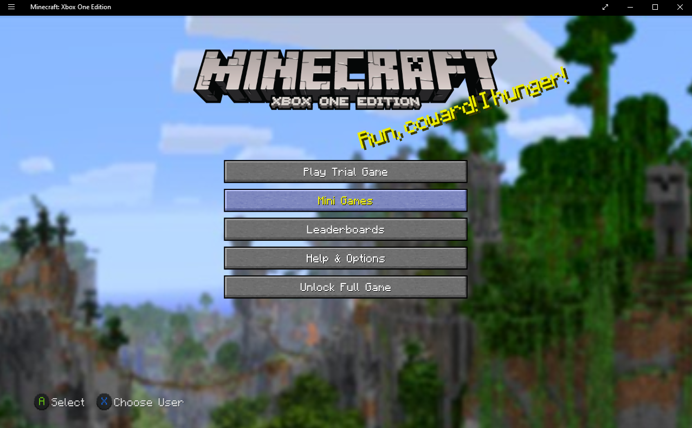
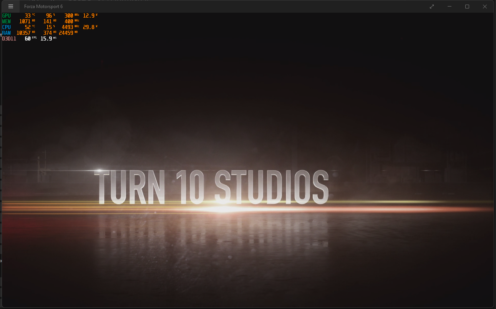
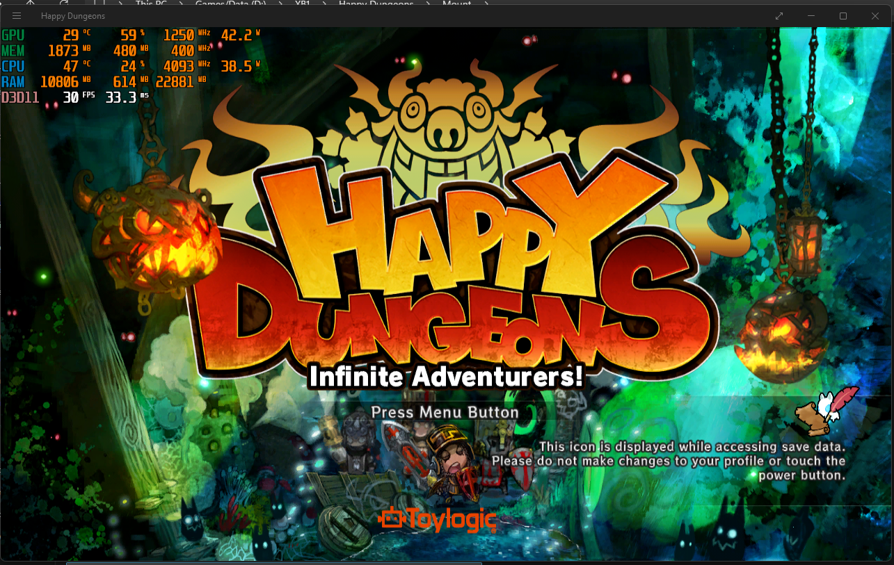
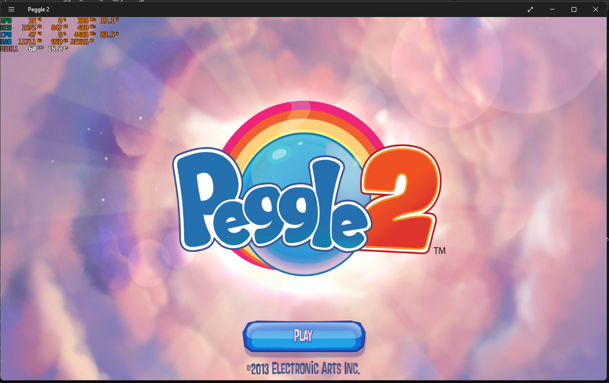
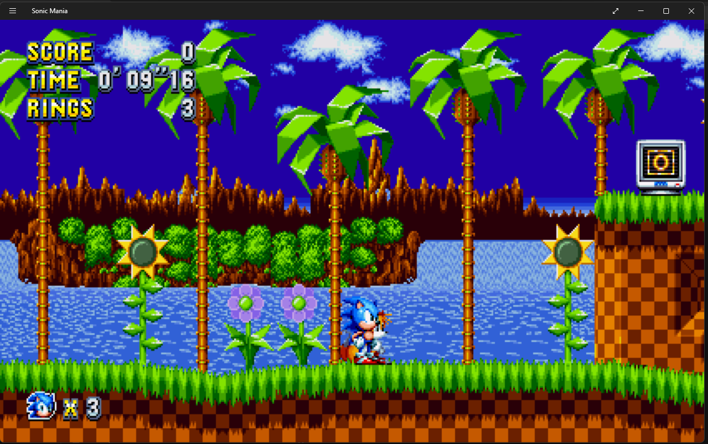
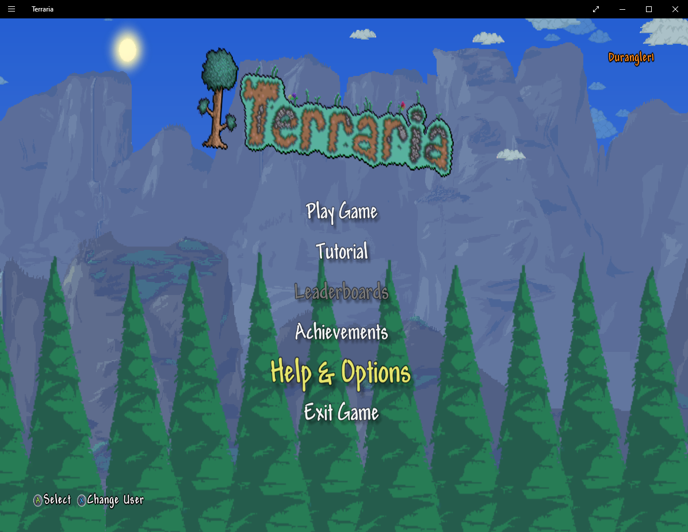

<a id="readme-top"></a>

<!-- PROJECT SHIELDS -->
<!--
test
*** I'm using markdown "reference style" links for readability.
*** Reference links are enclosed in brackets [ ] instead of parentheses ( ).
*** See the bottom of this document for the declaration of the reference variables
*** for contributors-url, forks-url, etc. This is an optional, concise syntax you may use.
*** https://www.markdownguide.org/basic-syntax/#reference-style-links
-->
[![Contributors][contributors-shield]][contributors-url]
[![Forks][forks-shield]][forks-url]
[![Stargazers][stars-shield]][stars-url]
[![Issues][issues-shield]][issues-url]
[![project_license][license-shield]][license-url]

<!-- PROJECT LOGO -->
<br />
<div align="center">
  <a href="https://github.com/WinDurango/WinDurango">
    
  </a>

<h3 align="center">WinDurango</h3>
  <p align="center">
    WinDurango is a clean-room Xbox compatibility layer for documented APIs,
    homebrew and project-owned fixtures on Windows.
    <br />
    <a href="https://github.com/WinDurango/WinDurango/issues">Report Bug</a>
    &middot;
    <a href="https://github.com/WinDurango/WinDurango/issues">Request Feature</a>
  </p>
</div>


<!-- TABLE OF CONTENTS -->
<details>
  <summary>Table of Contents</summary>
  <ol>
    <li>
      <a href="#about-the-project">About The Project</a>
      <ul>
        <li><a href="#playable-games">Playable Games</a></li>
      </ul>
      <ul>
        <li><a href="#screenshots">Screenshots</a></li>
      </ul>
    </li>
    <li>
      <a href="#getting-started">Getting Started</a>
      <ul>
        <li><a href="#prerequisites">Prerequisites</a></li>
        <li><a href="#building">Building</a></li>
        <li><a href="#installation">Installation</a></li>
      </ul>
    </li>
    <li><a href="#roadmap">Roadmap</a></li>
    <li><a href="#contributing">Contributing</a></li>
    <li><a href="#contact">Contact</a></li>
    <li><a href="#disclaimer">Disclaimer</a></li>
  </ol>
</details>


<!-- ABOUT THE PROJECT -->
## About The Project

WinDurango provides a host, input adapters, storage abstractions and API
contracts for project-owned applications. Compatibility with commercial Xbox
games, console discs, firmware and system images is not supported or promised.

The project is a clean-room compatibility layer. It does not contain Xbox
firmware, keys, system images, or code extracted from proprietary system
components. See [the architecture document](docs/ARCHITECTURE.md) for the
supported scope and roadmap.

### Diagnostic host

The CMake build also produces `WinDurangoHost`, a small executable for checking
the build and probing compatibility DLLs supplied by the user:

The host can also be configured independently of the generated WinRT projects:

```powershell
cmake -S projects/WinDurango.Host -B build-host
cmake --build build-host --config Release
```

```text
WinDurangoHost --version
WinDurangoHost --list-modules
WinDurangoHost --capabilities
WinDurangoHost --self-test
WinDurangoHost --window
WinDurangoHost --load-apis
WinDurangoHost --load-api C:\caminho\MinhaApi.dll
WinDurangoHost --probe .\\winrt_x.dll
```

`--window` abre um shell próprio de diagnóstico/compatibilidade. Ele não carrega
`$SystemUpdate`, firmware, arquivos `.xvd` ou executáveis proprietários.

Para testar um dashboard próprio com serviços auxiliares, coloque o executável
principal em `apps\\` e os auxiliares em `services\\`:

```text
WinDurangoHost --launch-dashboard apps\\dashboard.exe --background services\\input.exe
```

O supervisor aceita somente `.exe` nesses diretórios e encerra os serviços
quando o dashboard termina.

Homebrew próprio pode usar o pacote nativo do host:

```text
WinDurangoHost --launch-package apps\\MeuHomebrew.wdapp
```

O pacote precisa conter `app.exe`; DLLs próprias podem ficar em `apis\\` e
serviços auxiliares em `services\\`.
Durante a execução, o dashboard e os serviços recebem a variável de ambiente
`WINDURANGO_API_ROOT` com o caminho da pasta `apis\\` do pacote.

APIs próprias podem ser colocadas em `apis\\`; o host descobre DLLs
automaticamente e exige o contrato ABI documentado em `apis/README.md`.
O CI compila uma DLL-fixture própria e executa o teste CTest de descoberta.

Para diagnosticar uma mídia sem carregá-la:

```text
WinDurangoHost --inspect-media caminho\para\arquivo.xvd
```

Formatos Xbox proprietários são identificados e reportados como não suportados;
nenhum conteúdo é executado.

The host does not load Xbox firmware or system images.

After configuring a build, run the contract checks with:

```powershell
ctest --test-dir build -C Release --output-on-failure
```

On Windows this includes the host self-test and the PowerShell project
invariants when PowerShell is available.

To inspect the local build environment:

```powershell
./tools/doctor.ps1
```


## Screenshots

| Minecraft | Forza Motorsport 6 |
| --- | --- |
|  |  |

| Happy Dungeons | Peggle 2 |
| --- | --- |
|  |  |

| Sonic Mania | Terraria |
| --- | --- |
|  | 


### Historical upstream status

The following list came from the original upstream README and is retained only
as historical context. It is not a current compatibility claim and has not been
validated by this clean-room host:

 - Sonic Mania - Playable
 - Minecraft: Xbox One Edition (version 1.2.0.0) - Playable
 - Minecraft: Xbox One Edition (versions 1.61.X.X) - Boots
 - LIMBO - Playable
 - Forza Horizon 2 and it's variants - Boots
 - Forza Motorsport 5 - Boots
 - Peggle 2 - Boots


<!-- GETTING STARTED -->
## Getting Started

Before Building WinDurango make sure you install the prerequisites.

### Prerequisites

Make sure you have Visual Studio 2022 with the Desktop C++ workload, vcpkg and
CMake 3.30 or newer.

### Building

1. Open the `Developer PowerShell for VS 2022`
2. Clone the repo
   ```sh
   git clone https://github.com/WinDurango/WinDurango
   ```
3. Install VCPKG packages
   ```sh
   vcpkg install
   ```
4. Configure CMake for Visual Studio 2022
   ```sh
    cmake -S . -B .cmake/VS2022 -G "Visual Studio 17 2022" -A x64
   ```
5. Build WinDurango
   ```sh
   cmake --build .cmake/VS2022 --config Release --target WinDurango
   ```

### Installation

1. Build `WinDurangoHost` using the documented CMake workflow.
2. Put project-owned APIs in `apis\\` or load them explicitly with `--load-api`.
3. Package project-owned homebrew as `.wdapp` with `app.exe` and optional
   `apis\\`/`services\\` directories.
4. Run the host diagnostics and CTest contract checks.

### Visual Studio 2022

Abra `WinDurango.sln` no Visual Studio 2022 e selecione `Debug|x64` ou
`Release|x64`. A solução usa o projeto Makefile `WinDurango.CMake` para
configurar o CMake com o gerador `Visual Studio 17 2022` e compilar o alvo
`WinDurango`; ela requer CMake 3.30+ no `PATH` e o workload Desktop C++.
Se `VCPKG_ROOT` estiver definido, o script usa automaticamente o toolchain do
vcpkg.


### Minimum Requirements

WinDurango does not have a fixed and correct minimum requirements list, as some games are more demands than others (e.g. Minecraft uses way less system resources than Forza). However, we can speculate system requirements that **should** supply the needs of most games:

- A CPU with at least 4 cores (e.g. Intel Core i5 4690K)
- A GPU with at least 2GB of VRAM (e.g. NVIDIA GeForce GTX 960)
- 8GB of RAM (DDR3 or newer; 12GB or more is recommended)
- Windows 10 or newer

<!-- ROADMAP -->
## Roadmap

- [ ] Get Minecraft: Xbox One Edition (versions 1.61.X.X) to a playable state
- [ ] Get Forza Horizon 2 and it's variants to a playable state
- [ ] Get Forza Motorsport 5 to a playable state
- [ ] Get Peggle 2 to a playable state


<!-- CONTRIBUTING -->
## Contributing

Contributions are what make the open source community such an amazing place to learn, inspire, and create. Any contributions you make are **greatly appreciated**.

If you have a suggestion that would make this better, please fork the repo and create a pull request. You can also simply open an issue with the tag "enhancement".
Don't forget to give the project a star! Thanks again!

1. Fork the Project
2. Create your Feature Branch (`git checkout -b feature/AmazingFeature`)
3. Commit your Changes (`git commit -m 'Add some AmazingFeature'`)
4. Push to the Branch (`git push origin feature/AmazingFeature`)
5. Open a Pull Request

<!-- CONTACT -->
## Contact

Join our [Discord](https://discord.gg/mHN2BgH7MR)


<!-- DISCLAIMER -->
## Disclaimer

The goal of this project is to experiment, research, and educate on the topic of emulation of modern devices and operating systems. It is not for enabling illegal activity. All information is obtained via reverse engineering of legally purchased devices and games and information made public on the internet (you'd be surprised what's indexed on Google...). We are not any way affiliated with Microsoft.

## Credits
Thanks to 
- @othneildrew for `Best Readme Template`


<!-- MARKDOWN LINKS & IMAGES -->
<!-- https://www.markdownguide.org/basic-syntax/#reference-style-links -->
[contributors-shield]: https://img.shields.io/github/contributors/WinDurango/WinDurango.svg?style=for-the-badge
[contributors-url]: https://github.com/WinDurango/WinDurango/graphs/contributors
[forks-shield]: https://img.shields.io/github/forks/WinDurango/WinDurango.svg?style=for-the-badge
[forks-url]: https://github.com/WinDurango/WinDurango/network/members
[stars-shield]: https://img.shields.io/github/stars/WinDurango/WinDurango.svg?style=for-the-badge
[stars-url]: https://github.com/WinDurango/WinDurango/stargazers
[issues-shield]: https://img.shields.io/github/issues/WinDurango/WinDurango.svg?style=for-the-badge
[issues-url]: https://github.com/WinDurango/WinDurango/issues
[license-shield]: https://img.shields.io/github/license/WinDurango/WinDurango.svg?style=for-the-badge
[license-url]: https://github.com/WinDurango/WinDurango/blob/main/LICENSE.md
